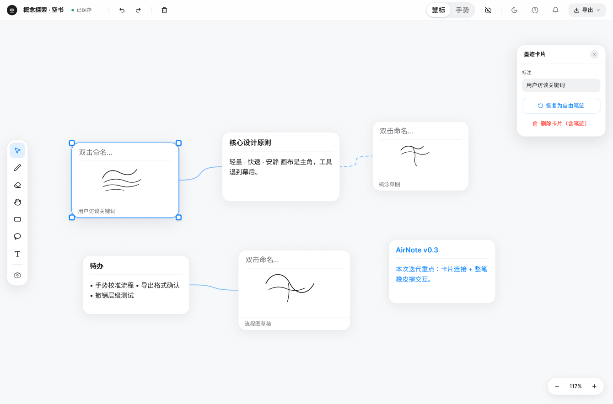
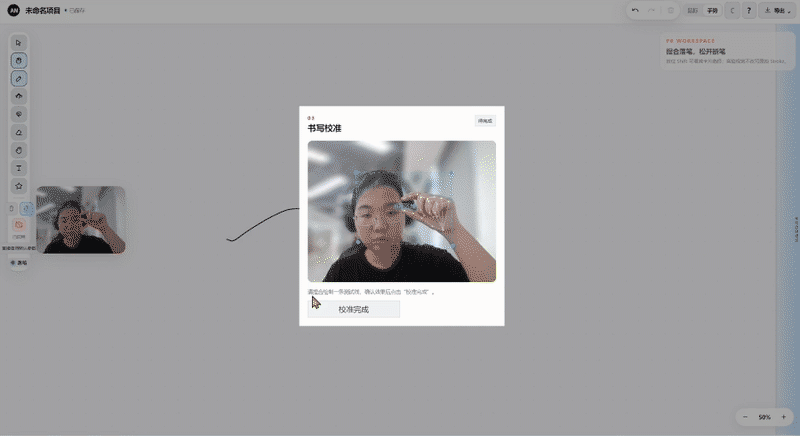
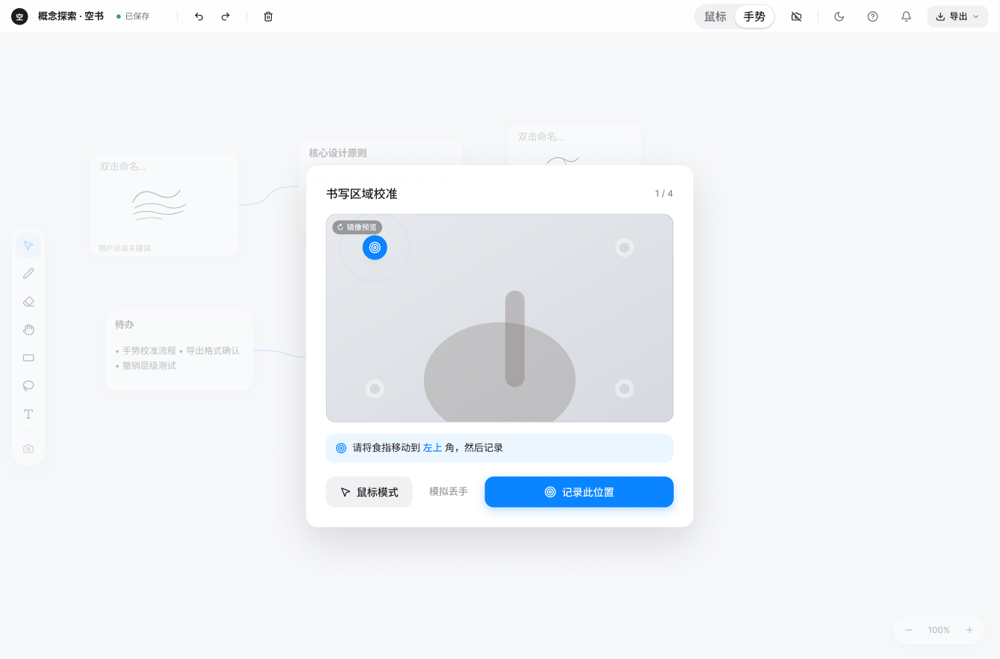
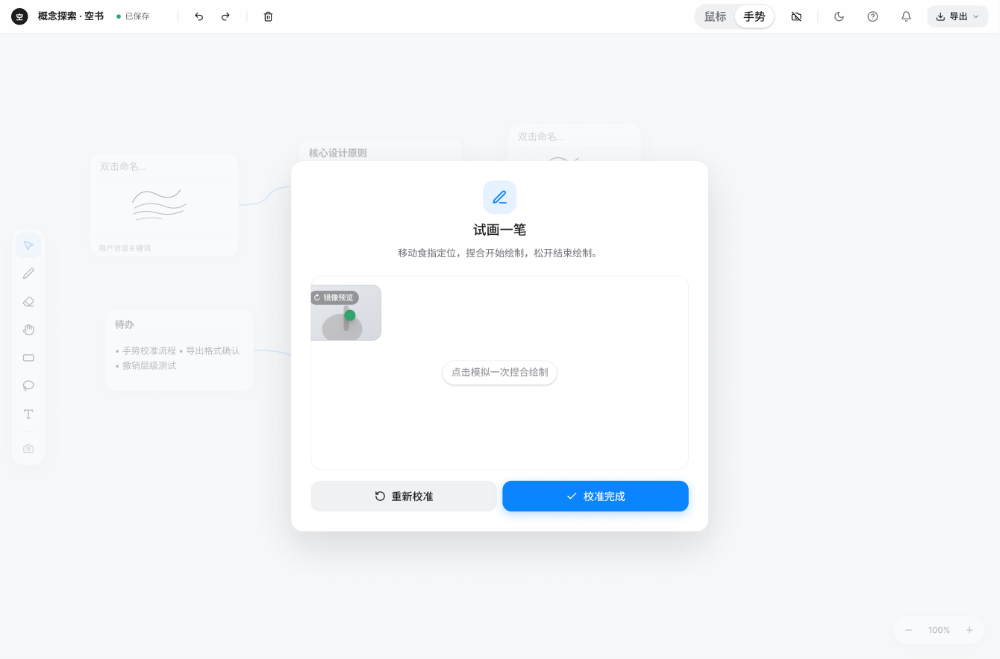
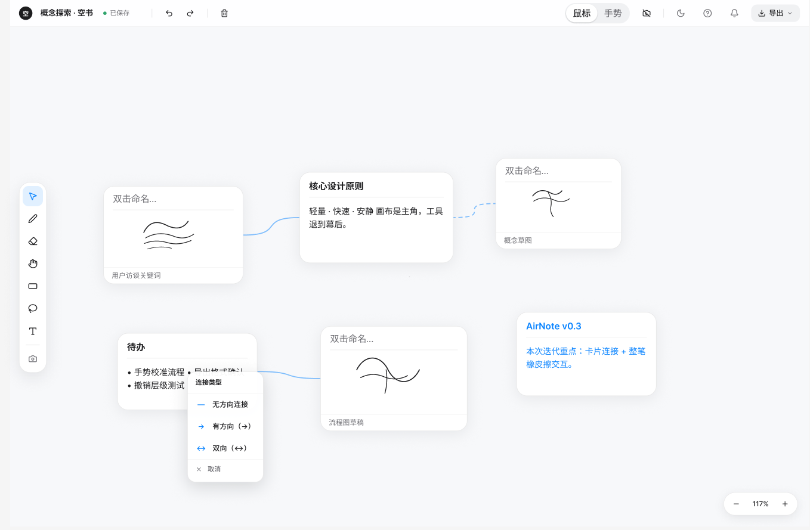
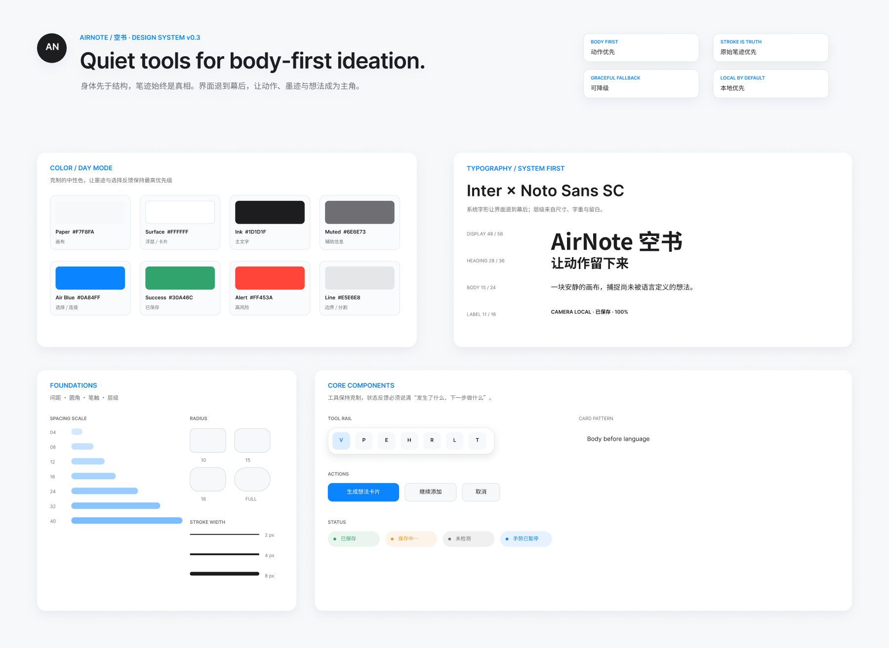

<p align="center">
  <a href="./README.zh-CN.md"><kbd>简体中文</kbd></a>
  <a href="./README.md"><kbd>English</kbd></a>
</p>

# AirNote / 空书

**An experimental creative scratchpad for generative art and creative coding.**

**Status: P0 MVP complete (`0.5.0-m4.1`) · P1 hypothesis exploration**

## Quick Overview

AirNote explores whether **imprecise, lower-pressure input can help creators externalize visual ideas before they are fully formed.** Its P0 MVP covers camera gesture / mouse input → Stroke → Group Suggestion → user confirmation → Card → Connection. Based on my own use after completing the MVP, I returned more often to free drawing than to Card / Edge organization, leading to a new direction: `Draw → Transform → Discover`. Whether visual variations can help creators discover a next step remains an unvalidated hypothesis.



<p align="center"><sub>P0 MVP: from free-form strokes to Cards and Connections.</sub></p>

### Gesture Drawing Demo

<a href="./docs/media/readme/gesture-drawing.mp4">
  
</a>

<p align="center"><sub>Gesture drawing demo · Click the GIF to watch the original MP4.</sub></p>

## Why I Built It

AirNote began with a problem I encountered while using TouchDesigner and generative art tools: I often had only a vague visual feeling, but found it difficult to decide what effect to try next through thought alone.

High-precision drawing tools are well suited to expression and refinement, but they do not always solve the question of “what should I try next?” when an idea is still taking shape. I wanted to test a less precise, lower-pressure form of expression: leaving Strokes through an ordinary camera gesture or mouse first, then observing whether those marks could help the idea develop.

Many gesture-drawing demos I encountered emphasized the input effect itself, with less attention to a usable flow for undoing, saving, organizing, and continuing the work. AirNote's first phase therefore went beyond “drawing in the air” and built a reusable MVP loop.

## Initial Product Hypothesis

The first product hypothesis was:

> A vague idea can first be externalized through free-form strokes, and the user can then decide whether to organize it into a structure.

The corresponding path was:

**Draw → Organize**

**Camera Gesture / Mouse → Stroke → Group Suggestion → User Confirmation → Card → Connection**

The system only proposes a group; it does not automatically interpret or submit the content. Cards and Edges test whether users need to name, move, and connect their ideas after preserving the original strokes.

## MVP Decisions / Product Trade-offs

| Product decision | Why | Trade-off |
|---|---|---|
| Use the web and an ordinary camera | No XR device, depth camera, or dedicated client is required | Ordinary cameras are more sensitive to lighting, occlusion, device performance, and tracking accuracy |
| Preserve mouse fallback | Camera access may be denied, occupied, or unreliable; prolonged arm use can also be tiring | The product is not gesture-only, and reliable editing still uses the mouse |
| Treat Stroke as the source of truth | Cards, visual styles, and later experiments must not overwrite the user's original marks | Derived capabilities must remain separate from the original data |
| Ask for confirmation after grouping, then create a Card | Stopping a stroke does not mean the system understands the user's intent | Adds one action, but avoids premature structuring and accidental submission |
| Include Card / Edge in the first phase | Tests whether naming, moving, and connecting help ideas develop after free drawing | Organization adds interaction cost and may pull attention away from drawing |
| Defer OCR, backend, and cloud sync | Prioritizes a local MVP while avoiding upload, key, cost, account, and privacy issues | No handwriting recognition, online project management, or cross-device sync |
| Do not use an LLM for automatic organization | There is no evidence yet that automatic naming, moving, or merging helps this creative stage | No AI content generation, automatic classification, or automatic mind maps |

## Current Prototype

The P0 MVP supports the following main path:

**Camera Gesture / Mouse**\
**→ Stroke**\
**→ Group Suggestion**\
**→ User Confirmation → Card**\
**→ Card / Edge Organization**\
**→ Local Save and Project Import / Export**

The current prototype includes:

- camera gesture and mouse input, with the core experience available when the camera is unavailable;
- pinch to draw, and stroke termination on release or tracking loss;
- Stroke creation, undo, redo, confirmed clearing, and whole-stroke erasing;
- group suggestions after drawing stops, followed by user-confirmed Card creation;
- Card movement, editing, deletion, and Edge connections;
- local autosave and project import / export;
- stable Ink rendering and optional, degradable Glow / Particle visual variations.

Glow and Particle exist as rendering capabilities, but this does not mean they have been shown to improve creative divergence.

<details>
<summary><strong>View prototype gallery</strong></summary>

<br>

<table>
  <tr>
    <td width="50%">
      
      <br><sub>Gesture writing-area calibration</sub>
    </td>
    <td width="50%">
      
      <br><sub>Gesture drawing test</sub>
    </td>
  </tr>
  <tr>
    <td width="50%">
      
      <br><sub>Card and Edge connection interaction</sub>
    </td>
    <td width="50%">
      
      <br><sub>AirNote design system</sub>
    </td>
  </tr>
</table>

</details>

## What Changed After the MVP

After completing P0, I revisited how I actually used the prototype.

The original hypothesis was:

**Draw → Organize**

But in my own use, what I kept returning to—and found more engaging—was **free drawing itself**, rather than the later Card / Edge organization.

This raised a new product question:

> If the same original Stroke produces different visual variations, might a creator see a next step they had not previously imagined?

The direction now being explored is:

**Draw → Transform → Discover**

This is a personal observation from using the prototype, not a user-research conclusion. It neither proves the new direction nor invalidates Card / Edge. The original MVP remains a real first-phase product decision and development result.

The project is not centered on an LLM, but it gave me direct experience with problem definition, MVP trade-offs, validation boundaries, and revising a product hypothesis.

## Next Validation

The next phase needs to test both whether visual variations are valuable and whether that value can recur.

### What to Test

- Can a user form a specific creative direction from a visual variation that they did not have before?
- Will the user continue drawing or developing one of the results?
- Does the user describe the result as merely “visually appealing,” or as something that “helped me think of the next step”?
- At which stage are Card / Edge and Visual Variation useful?
- Does the effect remain after repeated use?

### How to Test

The planned method is **small-scale qualitative task testing**:

1. Invite people working with generative art, creative coding, or visual creation to complete an open-ended task.
2. Let them draw freely first while preserving the unchanged original Stroke.
3. Provide a small number of Visual Variations derived from that same Stroke and let them choose whether to develop one.
4. Observe whether they form a new, specific direction, continue interacting, and need Card / Edge at any stage.
5. Conduct a short follow-up interview to distinguish visual novelty from practical creative help.
6. When possible, follow up later to see whether the value is limited to a first-time experience.

The sample size has not yet been determined, and the test does not assume in advance that the new direction will succeed.

## Current Boundaries

### Implemented

- Camera gesture and mouse input
- Original Stroke creation and preservation
- Group Suggestion and user-confirmed Card creation
- Card / Edge organization
- Undo, redo, and recoverable editing
- Local save and project import / export
- Optional Glow / Particle visual variations

### Not Yet Validated

- Whether Card / Edge is the core value or an optional later-stage organization tool
- Whether Visual Variation actually supports creative divergence
- Whether users would continue using this process
- Whether it improves creative efficiency or creative quality
- Whether `Draw → Transform → Discover` is more valuable than the first-phase path

### Not Implemented

- OCR or handwriting recognition
- LLM-based automatic naming, classification, or organization
- Backend, accounts, or cloud sync
- Multiplayer collaboration or public sharing
- Integration with TouchDesigner, Blender, Processing, or other external tools
- Multiple workspaces / multi-project management

These items are not roadmap commitments and do not imply that the capabilities already exist.

## Run Locally

Requirements: Node.js 24.x, npm 11.x, and desktop Chrome or Edge.

```bash
git clone https://github.com/yunyunyunzaipiao-dot/airnote.git
cd airnote
npm ci
npm run dev
```

The default local URL is `http://localhost:5173/`.

The page does not request camera permission on load. Users can draw directly with the mouse, or actively enable the camera and use gesture drawing after completing or skipping calibration.

## For Developers

AirNote currently uses React, TypeScript, Vite, and a locally hosted MediaPipe Hand Landmarker. The engineering implementation serves the product hypothesis; the project is not primarily intended as a frontend technology showcase.

### Project Structure

- `src/camera/`, `src/handTracking/`, `src/gesture/`: camera, hand tracking, and gesture state
- `src/drawing/`, `src/visualEffects/`: Stroke and experimental visual-variation rendering
- `src/strokeGroups/`, `src/cards/`, `src/edges/`: grouping, Cards, and connections
- `src/store/`, `src/history/`, `src/persistence/`: workspace state, history, and local persistence
- `src/export/`: image and project-data import / export
- `src/tests/`: automated tests
- `public/mediapipe/`: local model and WASM resources

### Engineering Checks

```bash
npm run typecheck
npm test
npm run build
```

Automated tests check functional behavior, error handling, and data invariants. They do not prove that the product value or user need has been validated.

### Privacy & Data Boundaries

- The camera can only be enabled by the user.
- Video frames and hand landmarks are processed in browser runtime memory.
- Camera footage is not recorded, saved, or uploaded by default.
- The workspace is stored locally in the browser.
- Project JSON does not contain video, landmark streams, API keys, or access tokens.
- Experimental visual variations must not overwrite or reorder the original `Stroke.points`.

### Product & Development Records

- [Product background document](./AirNote_01_产品背景文档_v0.3.docx)
- [Product requirements document](./AirNote_02_产品需求文档_AI执行版_v0.3.docx)
- [Product boundaries document](./AirNote_03_产品边界文档_v0.3.docx)
- [Daily development progress](./docs/progress/README.md)
- [Version and change records](./CHANGELOG.md)
- [Versioning rules](./docs/VERSIONING.md)

### Detailed Feature Scope

For complete feature IDs, failure handling, boundary conditions, and acceptance criteria, see:

- [Product requirements document](./AirNote_02_产品需求文档_AI执行版_v0.3.docx)
- [Product boundaries document](./AirNote_03_产品边界文档_v0.3.docx)
- [CHANGELOG](./CHANGELOG.md)
- [Daily development progress](./docs/progress/README.md)
