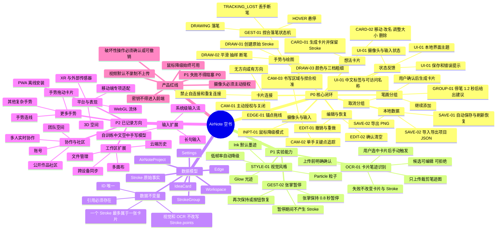
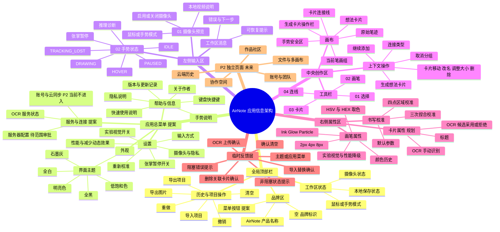

# AirNote / 空书｜功能架构与信息架构

更新时间：2026-07-17  
依据：产品背景文档 v0.2、产品需求文档 v0.2、产品边界文档 v0.2，以及当前已确认的 UI 与 P1 实施记录。

## 标记说明

- `P0`：MVP 发布门槛。
- `P1`：核心闭环完成后的可关闭实验能力。
- `P2`：已记录方向，当前不实施。
- `提案`：本次新增的信息架构建议，尚未成为正式功能需求。

## 推荐的顶部入口

“空”字应继续承担品牌标识，不再单独代表主题。

在品牌区旁增加一个长期可见的“菜单”按钮，例如 `菜单⌄`。点击后打开应用总菜单，按以下四组组织：

1. 外观：界面主题。
2. 设置：输入方式、重新校准、张掌暂停、实验视觉。
3. 帮助与信息：使用说明、快捷键、隐私说明、版本信息、关于作者。
4. 服务与连接：OCR 服务状态；未来服务器配置只能在产品边界和 PRD 更新后加入。

这样以后增加栏目时不需要不断改变“空”字的含义，用户也能直接看懂入口。

## 功能架构思维导图



## 信息架构思维导图



## 建议的应用总菜单层级

```text
菜单
├─ 外观
│  └─ 界面主题
├─ 设置
│  ├─ 输入与摄像头
│  ├─ 重新校准
│  ├─ 张掌暂停
│  └─ 实验视觉
├─ 帮助与信息
│  ├─ 使用说明
│  ├─ 快捷键
│  ├─ 隐私说明
│  ├─ 版本信息
│  └─ 关于作者
└─ 服务与连接
   ├─ OCR 服务状态
   └─ 服务器配置（待产品边界与 PRD 批准）
```

## 边界说明

- “关于作者”、帮助、隐私和版本信息可以作为纯信息栏目规划，不需要账号或后端。
- OCR 服务状态可以展示“未配置、可用、暂不可用”，但不得在前端保存 API 密钥。
- 新增通用服务器、账号、云同步或多人能力属于范围扩张，必须先更新产品边界文档，再更新 PRD 和功能 ID。
- 应用菜单只负责导航和展示，不得改变捏合落笔、卡片确认生成、撤销恢复或本地保存规则。
