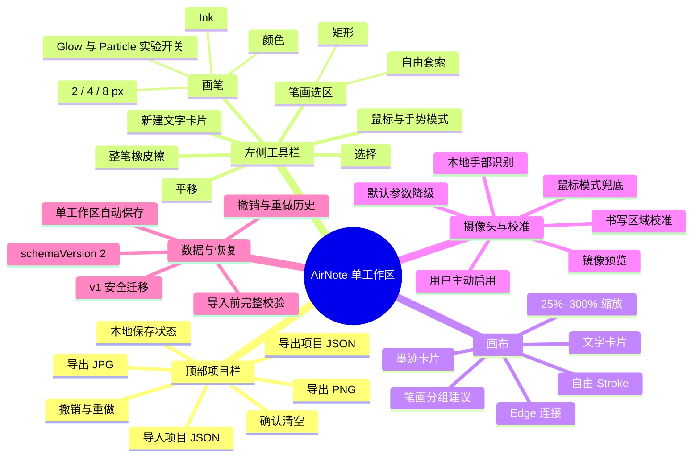
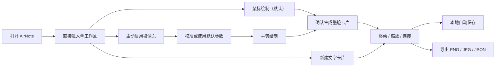

# AirNote / 空书：目标功能架构（v0.3）

> 当前产品形态：单工作区。此架构是 Figma 信息架构与页面结构的直接输入。

## 1. 功能架构总览

## 2. 页面层级

AirNote 当前只有一个主要页面：`Workspace / 工作区`。

没有启动 Gallery，没有首次打开的新手引导遮罩。后续引导需在 UI 结构稳定后单独设计。

## 3. 工作区布局

| 区域 | 位置 | 内容 | 设计优先级 |
|---|---|---|---|
| 顶部栏 | 顶部横向 | 品牌/工作区名、保存状态、撤销重做、清空、导入导出 | P0 |
| 工具栏 | 左侧浮动 | 选择、输入方式、画笔、橡皮擦、平移、选区、文字卡片 | P0 |
| 主画布 | 全屏主体 | Stroke、Card、Edge、选择和分组反馈 | P0 |
| 摄像头区 | 左侧工具栏下部或可展开浮层 | 预览、启停、输入模式、错误状态 | P0 |
| 校准/属性区 | 右侧按需出现 | 校准步骤、选中对象属性 | P0 / 渐进披露 |
| 缩放控制 | 右下角浮动 | 缩小、百分比复位、放大 | P0 |
| 状态提示 | 底部或画布浮层 | 保存、错误、性能降级、操作结果 | P0 |

## 4. 核心对象

### Stroke

- 原始点序列、颜色、粗细、视觉样式和创建时间。
- 自由 Stroke 可由整笔橡皮擦删除。
- 卡片内 Stroke 只能通过删除所属墨迹卡片删除。
- OCR 和视觉效果不得改写几何点。

### Ink Card / 墨迹卡片

- 标题、位置、尺寸和所属 Stroke ID。
- 支持移动、四角缩放、连接、改名和删除。
- 删除前明确告知将同时删除 Stroke 和关联 Edge；一次撤销完整恢复。

### Text Card / 文字卡片

- 标题、正文、位置、尺寸和整卡文字样式。
- 格式仅包括粗体、斜体、下划线、文字颜色。
- 不提供分段富文本、Markdown、图片或网络内容。

### Edge

- 连接两张现存卡片。
- 支持有方向/无方向与四边锚点。
- 任一端卡片删除时，Edge 同时删除。

## 5. 关键交互状态

### 画布工具互斥

- `Draw`：鼠标绘制；手势模式下捏合绘制。
- `Erase`：点击或划过自由 Stroke，整笔删除。
- `Pan`：拖动画布，仅改变 viewport。
- `Select`：移动/缩放卡片、创建连接。
- `Lasso Rect / Free`：选择自由 Stroke，产生“生成卡片”建议。

### 摄像头

`未启用 → 请求权限 → 加载模型 → 运行 → 校准/默认参数 → 手势绘制`

任意失败都回到可用鼠标模式。页面加载时不得自动请求权限。

### 保存与导入

- 内容或设置变化后 800ms 防抖保存，不逐帧写入。
- 导入先迁移、再完整校验、最后一次性替换。
- 导入失败保留当前画布，并给出可执行提示。

## 6. Figma 需要设计的 Frame

1. 工作区 / 空状态 / 鼠标模式。
2. 工作区 / 有自由笔迹与分组建议。
3. 工作区 / 墨迹卡片 + 文字卡片 + Edge。
4. 文字卡片 / 编辑与基础格式状态。
5. 卡片 / 选中、固定四角缩放柄与连接锚点。
6. 整笔橡皮擦 / hover 或命中反馈。
7. 平移 / 抓取与拖动状态。
8. 摄像头 / 未启用、请求中、运行、拒绝、占用、模型失败。
9. 校准 / ROI、捏合、复核与默认参数。
10. 删除卡片确认、清空确认、导入确认。
11. 保存中、已保存、保存失败、导入失败、性能降级 Toast。
12. 25%、100%、300% 三种画布密度检查。

## 7. 明确排除的 Frame

不要设计 Gallery、项目列表、登录注册、团队协作、分享权限、云端历史、图片卡片、局部橡皮擦或完整富文本编辑器。
